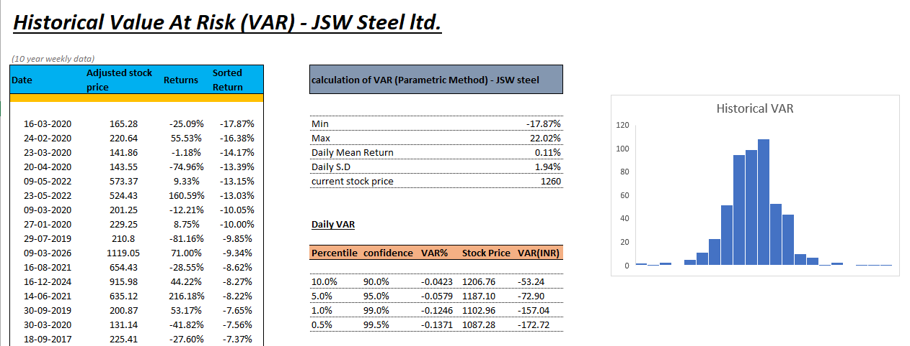
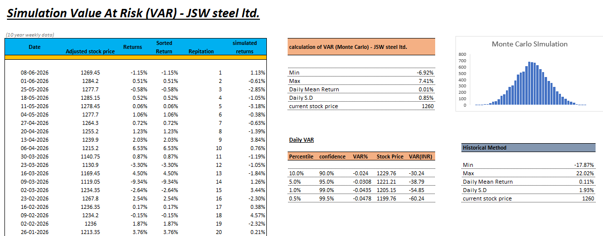

# JSW Steel – Value at Risk (VaR) Analysis

## Project Overview

This project analyzes the market risk of JSW Steel Ltd. using Value at Risk (VaR).

The analysis uses historical stock return data and applies two approaches:

- Historical/Parametric VaR analysis
- Monte Carlo Simulation

The model is developed in Microsoft Excel and calculates potential losses at different confidence levels.

---

## Excel Model

The complete Excel model can be downloaded here:

**[Download Excel VaR Model](JSW-VAR-Anaysis.xlsx)**

---

## Objectives

The main objectives of this project are:

- Analyze historical returns of JSW Steel.
- Measure potential downside risk using VaR.
- Compare risk estimates using different methodologies.
- Understand the application of quantitative risk management techniques in equity analysis.

---

## Methodologies Used

### 1. Historical / Parametric VaR

The model analyzes historical stock returns and calculates risk measures including:

- Calculate weekly returns from adjusted prices.
- Sort returns from lowest to highest.
- Read the return at each percentile (10%, 5%, 1%, 0.5%).
- Multiply by the current price to get VaR in ₹.l

  

---

### 2. Monte Carlo Simulation

Monte Carlo simulation is used to generate simulated stock returns based on the return distribution.

The simulation includes:

- Estimate the mean and standard deviation of weekly returns.
- Simulate a large number of random returns from that distribution.
- Sort the simulated returns and read the same percentiles.
- Multiply by the current price to get VaR in ₹.

 
---

## Key Risk Measures

The model estimates VaR in both percentage and INR terms.

The analysis considers confidence levels of:

| Percentile | Confidence Level |
|------------|------------------|
| 10% | 90% |
| 5% | 95% |
| 1% | 99% |
| 0.5% | 99.5% |

VaR represents the estimated potential loss in the stock price over the selected time horizon at a given confidence level.

---

## Key Insights

- At 95% confidence, historical VaR is ₹72.90 (5.79%): in 95% of days, the loss is not expected to exceed this.
- Historical VaR is higher than Monte Carlo VaR at every confidence level, and the gap widens in the tails.
- The worst historical weeks cluster in early 2020 and mid-2022. Historical VaR captures these crashes, while a normal-distribution simulation tends to understate extreme losses.
- Extreme-tail VaR (99% and 99.5%) depends on very few observations, so it should be read with caution.
  
---

## Tools Used

- Microsoft Excel
- Financial Modeling
- Statistical Analysis
- Value at Risk
- Monte Carlo Simulation
- Equity Risk Analysis

---

## Financial Concepts

This project demonstrates practical application of:

- Value at Risk (VaR)
- Market Risk
- Volatility
- Probability Distribution
- Monte Carlo Simulation
- Quantitative Risk Management

---

## Related Project
[JSW Steel Relative Valuation](https://github.com/utkarshmalra-svg/JSW-Steel-Relative-Valuation)

---

## Author

Utkarsh Singh Malra 

---

## Disclaimer

This project is created for educational and analytical purposes only. The analysis should not be considered investment advice or a recommendation to buy or sell securities.
